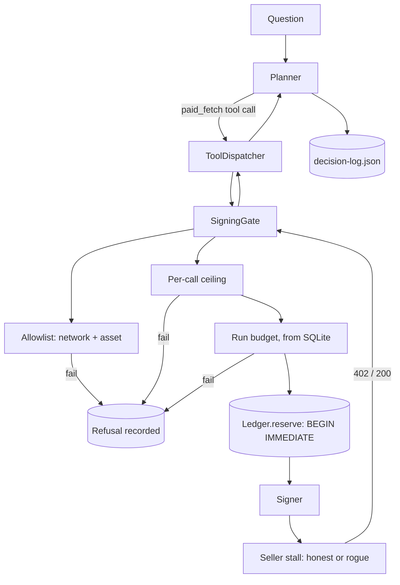

# The Coin Purse (P2)

An LLM research agent with a small, hard-capped test purse. It can pay `x402`
endpoints on its own, and it cannot be talked out of its limits — not by a
model, not by a seller, not by anything the seller says in a response body.

The interesting part is not that the agent can pay. It is that **every refusal
is recorded, and the record cannot overstate what happened.**

```bash
npm install
npm run demo          # runs a real agent turn, then opens a read-only UI
```

Then open the URL it prints and press **Run the agent**. `Ctrl-C` stops
everything.

**Where to read next.** [`ARCHITECTURE.md`](./ARCHITECTURE.md) is the structure
as it shipped and why each load-bearing decision is a property of the control
flow — start there if you are reviewing the design.
[`../docs/rubric-traceability.md`](../docs/rubric-traceability.md) is the map
from each rubric check to the file and the test that proves it, and it is itself
checked by `tests/rubric-traceability.test.ts`.
[`../docs/p2-coin-purse-design.md`](../docs/p2-coin-purse-design.md) is the
reasoning from before the code existed, reconciled against what shipped.

---

## Read this first: what "paid" means here

**No real money moves in this repository.** Not on `main`, not in the demo, not
in the test suite.

Three pieces are deliberately stubbed, and the UI says so in three places:

| Piece | Real in this repo | Stubbed as |
|---|---|---|
| The model | — | `ScriptedPlanner`, a fixed list of tool calls |
| The signer | Counts calls, derives deterministic test keys | never produces a usable chain signature |
| The facilitator | Speaks the real `X-PAYMENT`/`X-PAYMENT-RESPONSE` shape | settles in memory and reports success |

So a tool result reading `paid` means **"a local policy and protocol decision
was made and a signature was produced."** It does not mean a transfer settled on
Ethereum Sepolia. The record and the UI both call this state `settled-stub`, and
`settled-stub` is the only word used for it.

What *is* real: the `x402` header parsing, the per-call ceiling, the run budget,
the network/scheme/asset/payee allowlist, the host **and port** allowlist, the
double-spend and hold accounting, the `bait-and-switch` detection, the
prompt-injection quarantine, and the durable ledger those decisions are written
to. The HTTP requests really do go over the wire to a real server, which is why
the guard in `src/x402/guarded-transport.ts` has something to guard.

---

## Commands

| Command | What it does |
|---|---|
| `npm run demo` | The main path. Starts sellers, runs the full 10-call plan, writes the record, serves the UI. |
| `npm run demo:headless` | The same run, no UI. Exits when the run finishes. |
| `npm run ui` | Just the UI, for re-running from the browser against a fresh ledger. |
| `npm run agent` | The CLI path: one agent turn against the sellers, printed to stdout. |
| `npm run sellers` | The two local x402 sellers on their own. |
| `npm test` | 435 tests across 13 files. No network, no key, no chain. |
| `npm run typecheck` | `tsc --noEmit`. |
| `npm run scan:credentials` | 10 rules over every shipped file in the workspace. Exits non-zero on a finding. |
| `npm run verify` | `typecheck`, then `test`, then `scan:credentials`. The one command to run before believing anything in this file. |

`npm run demo` serves the UI and then waits for Ctrl-C, so it does not exit on
its own. Use `npm run demo:headless` in CI, or `npm run ui` to serve the page
without re-running the plan.

---

## The demo plan

`npm run demo` executes a fixed plan of ten calls, chosen so that every branch
of the gate is visible in one run. The seller quotes real prices; what the agent
does with them is the point.

| # | Call | Outcome | Why it is there |
|---|---|---|---|
| 1–4 | honest routes | `settled-stub` | the normal path |
| 5–6 | `/rogue/burner` ×2 | `free` | the burner gives two away |
| 7 | `/rogue/burner` | `settled-stub` | …then charges; the transition is visible |
| 8 | `/rogue/overpriced` | `not-paid` | 200× the per-call ceiling |
| 9 | `/rogue/hostile-notes` | `settled-stub` | an injection in the body, quarantined |
| 10 | `/rogue/bait-and-switch` | `budget-held` | reports 10× what was reserved |

The tenth is the one worth reading the record for. The seller quotes 500 base
units, the agent authorises 500, and the response claims 5000. The gate refuses
to record an over-settlement, so the row stays `interrupted`, the 500 stays
held, and the run ends with a visible unpaid hold rather than a clean-looking
total.

A real run ends with **$0.015 committed of a $5.00 budget, 7 signatures, and
$0.0005 held on one unresolved call.**

---

## What the record guarantees

`record/decision-log.json` is the artefact. Four properties are enforced by
`tests/record.test.ts` rather than by convention:

1. **No bare `paid`.** The settlement vocabulary is `not-reached`, `not-paid`,
   `settled-stub`, `budget-held`, `free`. The gate's own word (`paid`) is kept in
   a separate `gateOutcome` field so the two vocabularies stay comparable
   without conflating them.
2. **A refusal names the rule.** Not `refused` — the exact code, plus the amount
   that was asked for. An over-ceiling quote is recorded as
   `quoteAtomic: "5000000"`, `reason: "per-call-ceiling-exceeded"`, not as a
   blanket "malformed", because those send an operator to different files.
3. **Committed equals the sum of the settled rows.** Checked against the ledger,
   not against the summary the demo prints.
4. **Seller text stays fenced.** Every scrap of third-party prose is inside
   `UNTRUSTED_SELLER_DATA` markers with a `source` naming the tool and host. The
   injection is preserved verbatim — a record that quietly dropped the attack
   would be indistinguishable from one where nothing was attempted — and is
   asserted absent from every trusted field.

`chainTouched: false` and `realFundsMoved: false` sit at the top level of the
record, not in a footnote.

---

## The UI is read-only

There is no endpoint that accepts a ceiling, a budget, a network, an asset, a
payee, a host, a port or a key. `POST /api/run` does not read its request body
at all, so there is no field to smuggle a limit into — and a test asserts that
posting one does not move the number.

The page runs the *same* `PurseRuntime.run` as the CLI: the same
`runAgent` → `ToolDispatcher` → `SigningGate` → real HTTP seller path. It renders
events as they arrive; it decides nothing.

The listener is pinned to `127.0.0.1` and refuses a non-loopback bind. Static
files come from a fixed map of three files, so no request path can reach the
filesystem — an unknown path gets a 405, not a file. This is a demo UI, not a
hardened service — it is a boundary a local process can cross, and the code says
so.

### Checked in a browser, not just asserted

Driven with PinchTab against `npm run ui -- --port 5173`:

- **0** `input`, `select`, `textarea`, `form` and `[contenteditable]` elements.
  One button ("Run the demo") and one link (the skip link). No console errors.
- **A real `Tab` press** gives the focused control a 3px solid accent ring at a
  2px offset. The skip link is off-screen at rest and moves into view on focus,
  which is the only way it is reachable at all.
- **Motion is fully suppressed** under an emulated `prefers-reduced-motion:
  reduce` — zero running animations.
- **No sideways scroll from 320px up.** This one was a real bug, found only by
  measuring in a browser: at a 360px viewport the document was 609px wide,
  because `main` is a one-column grid and a grid column defaults to
  `minmax(auto, auto)`, whose `auto` *minimum* is the item's min-content width —
  so the wide calls table set the column and dragged every panel out with it.
  The tables were always fine; they sit in `overflow-x: auto` wrappers. Fixed
  with `minmax(0, 1fr)` and `min-width: 0`, and re-measured at 320 / 360 / 414 /
  768 / 1024 / 1440. `tests/record.test.ts` pins both declarations.
- **The `HELD NOW` column shows `$0.0005 held` on the one interrupted row and
  `—` on the other nine.** That is the bug this record was regenerated to fix;
  see "What the record guarantees" below.

---

## Security notes

- **Ports are pinned, not just hosts.** Allowlisting `127.0.0.1` would have let
  the agent pay any local process, including one an attacker started. The
  allowlist stores the exact `host:port` each seller bound.
- **A transport guard is the second line, not the first.** `withTransportGuard`
  refuses a non-loopback destination even if the allowlist is bypassed, and
  records a refusal instead of throwing.
- **The model cannot read a limit.** The `paid_fetch` schema has exactly two
  properties, `url` and `label`, with `additionalProperties: false`. There is no
  budget field to quote back, no allowlist to argue with, and no signer to
  address.
- **Signing is separate from fetching.** A signature is only ever produced by
  `SigningGate`, after the quote is decoded, checked against policy, and reserved
  in the ledger. The test suite asserts the signature count is zero for every
  refusal path.
- **No key material is in the repo.** `.env`, `*.key`, `*.pem` and `secrets/` are
  gitignored, and `createStubSigner()` is the only signer wired into the demo,
  the UI, or the tests. This is checked rather than asserted: `npm run
  scan:credentials` reads every shipped file in the workspace — P2, the sibling
  P1, and the shared docs — and exits non-zero on anything key-shaped. The
  committed result is in `../docs/rubric-traceability.md`, and the one suppressed
  line is printed with its reason on every run.

---

## Layout

```
src/
  agent/      loop, planner, tool schema, dispatcher, quarantine
  seller/     the honest x402 seller and the rogue one
  x402/       header decode, SigningGate, allowlist, transport guard
  policy/     the frozen policy and the refusal codes
  ledger/     durable SQLite: runs, reservations, refusals, settlements
  money/      atomic units and formatting
  app/        shared runtime, decision record
  ui/         the read-only server
public/       the page (no build step, no framework)
scripts/      demo, ui, agent, sellers
record/       the shipped decision-log.json
```

There is no build step for the UI. It is three static files — 212 lines of
markup, 449 of CSS, 384 of plain JavaScript — which is the right size for a page
whose job is to render a JSON record.

---

## Known limitations

- **No live model run is claimed.** `agent-llm.test.ts` drives a real
  OpenAI-compatible `POST /chat/completions` endpoint over a real socket, with
  only the model's *output* scripted turn by turn. So the request bytes, the
  tool-call handling and the reply framing are all real; the model is not. It
  proves the purse is unaffected by a misbehaving model — it does not prove any
  particular model is well-behaved. There is no model key in this environment.
- **No live-settlement suite exists.** There is no `vitest.live.config.ts` and no
  `tests/live.test.ts`; the two `test:live` / `ledger:report` entries that used to
  point at them have been removed rather than left as commands that fail. A funded
  Ethereum Sepolia run needs a wallet key and a facilitator, and neither is wired.
  Nothing in this repository has moved money.
- **The signer and facilitator are stubs**, so the settlement *protocol* is
  exercised but the settlement *outcome* is not. Nothing here demonstrates that
  a real facilitator would accept these signatures.
- **Single-writer SQLite.** The ledger is fine for one agent and one UI, and
  would need real transactions before two processes shared it.
- **The demo resets `data/demo.sqlite`** so the run is deterministic and the
  numbers above are the numbers you get. Any previous demo ledger is overwritten.

## Architecture



Money only moves on the last edge, and only if a signature exists. Every refusal
above the signer is written to SQLite with the rule that fired and the amount
asked for.

## Verified status

Run locally on this machine. Numbers are what the commands printed.

| Command | Result |
|---|---|
| `npm run typecheck` | exit 0 |
| `npm test` | **458 / 458 passing**, 15 files |
| `npm run scan:credentials` | **PASS**, 87 files, 0 findings |

**No live payment has been made. There is no transaction hash, and none is
claimed.**

## Environment

Copy `.env.example` to `.env`. `.env` is gitignored. Do not commit it.

| Variable | Required | Purpose | Value |
|---|---|---|---|
| `X402_PAY_TO` | no | Public address the honest stall would collect into. Not a secret. | `0x` + 40 hex - **you supply** |
| `EVM_PRIVATE_KEY` | no | Payer key. **Deliberately not supplied - see Known gaps.** | leave blank |
| `X402_FACILITATOR_URL` | no | Defaults to `https://facilitator.x402.rs` | leave blank |
| `PURSE_ALLOWED_NETWORKS` | no | Defaults to `eip155:11155111` | leave blank |
| `PURSE_ALLOWED_ASSETS` | no | Defaults to `eip155:11155111=0x1c7D...C7238` | leave blank |
| `PURSE_PER_CALL_CEILING` | no | Defaults to `25000` base units ($0.025) | leave blank |
| `PURSE_RUN_BUDGET` | no | Defaults to `5000000` base units ($5.00) | leave blank |
| `LLM_API_KEY` | no | Only for `PURSE_PLANNER=llm`. The scripted planner needs none. | leave blank |

## Local simulation vs live Sepolia

Running with no `.env` at all gives a complete, labelled, offline demo: real HTTP
to real local seller processes, real SQLite, real policy decisions, real
refusals. The signer and the facilitator are **local stubs**, so every settlement
is labelled `settled-stub` and the record states `chainTouched: false` and
`realFundsMoved: false`. Nothing touches a chain and no funds move.

## Known gaps

1. **Real payment is unavailable in this architecture, by design.** The signing
   gate runs inside the Node agent process and calls `Signer.createPaymentPayload`
   synchronously. A browser wallet lives in the browser, so a MetaMask signature
   cannot be obtained from inside this loop without moving the signing step out
   of the server.
2. **The loader enforces this rather than allowing a partial setup.**
   `EVM_PRIVATE_KEY` and `X402_PAY_TO` must be set **together or not at all**, so
   a payTo alone cannot silently switch on a payment path. A test asserts
   `config.payment` is `null` in the shipped configuration.
3. **To support MetaMask**, a browser-mediated flow is needed: the page signs,
   posts the signature to the server, and the server replays it to the seller.
   That is an architectural change, not configuration.
4. The committed `record/decision-log.json` is from a **real local run**, not a
   real testnet run. It says so in its own `settlement` block.
5. No browser testing was performed by the author of these changes.
